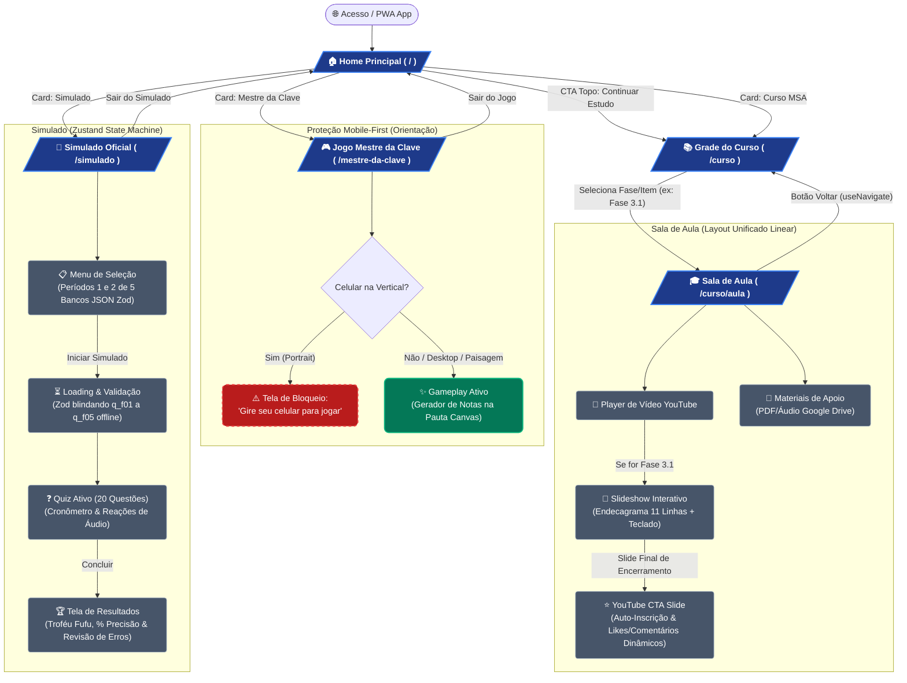

# Mapa de Experiência e Fluxo do Usuário: Issa Academy

Este documento mapeia a arquitetura de navegação, transições de estado, abas interativas e guardas de UX (User Experience) da plataforma **Issa Academy**. Diferente do mapa de diretórios, este fluxo representa a **jornada dinâmica do estudante** navegando pela SPA (Single Page Application) e PWA Offline-First.

---

## 🗺️ Diagrama de Fluxo (Mermaid.js)

O gráfico abaixo modela a navegação declarativa via React Router (`<HashRouter>`), as máquinas de estado gerenciadas por Zustand (`useQuizStore`), e os bloqueios de UX (como o sensor de orientação para dispositivos móveis):

---

## 🧭 Legenda da Arquitetura de UX

| Elemento / Cor | Significado Arquitetural | Exemplo no Projeto |
| :--- | :--- | :--- |
| **🟦 Rotas da SPA (Azul)** | Telas de nível superior configuradas em `App.tsx` com `React.lazy` e Code Splitting. | `/curso`, `/simulado`, `/mestre-da-clave` |
| **🟩 Ambientes Interativos (Verde)** | Telas ou modais de alta interatividade que utilizam motores visuais, síntese de áudio ou o motor vetorial `<StaffSvgEngine />`. | Gameplay do Mestre da Clave, Slideshow do Endecagrama |
| **🟥 Guardas de UX (Vermelho Tracejado)** | Bloqueios condicionais de interface que previnem experiências ruins no celular. | Componente `<OrientationGuard />` bloqueando orientação retrato na pauta |
| **⬛ Estados e Abas (Cinza)** | Sub-telas controladas por estado interno sem transição de URL na rota ativa. | Abas da Sala de Aula, Fases de carregamento do Simulado |

---
*Mapa atualizado automaticamente em: 03/07/2026 pela skill map-builder do agente Antigravity.*
